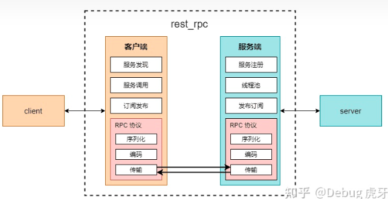
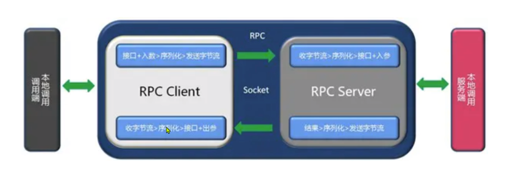
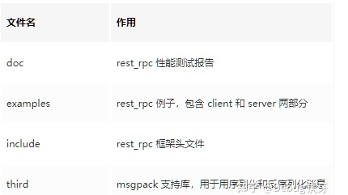
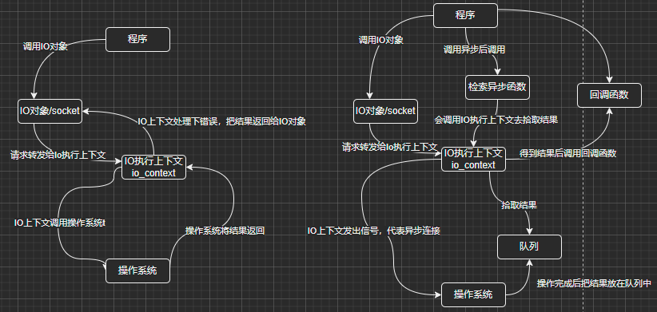

# rest_rpc技术分享

## 分析目的

​			网格重构项目采用的远程调用框架

## rest_rpc简介

rest_rpc是一个高性能、易用、跨平台、header only的c++11 rpc库，它的目标是让tcp通信变得非常简单易用，即使不懂网络通信的人也可以直接使用它。可以快速上手，使用者只需要关注自己的业务逻辑即可。

RPC 是 Remote Procedure Call 即 远程过程调用 的缩写。

### 什么是RPC

RPC（Remote Procedure Call，远程过程调用） 两个不同系统间的数据通信，往往可以通过socket+自定义数据报文来实现。举个例子来讲，有两台服务器 A、B 现在 A 上的程序想要远程调用 B 上应用提供的函数/方法，就需要通过网络来传输调用所需的消息。

但是消息的网络传输涉及很多东西，例如：

- 客户端和服务端间 TCP 连接的建立、维持和断开
- 消息的序列化、编组
- 消息的网络传输
- 消息的反序列化等等
- 调用的重试，容错，超时处理，收发线程等

TODO：也可以基于http、webservice发送数据

RPC 的作用就是屏蔽网络相关操作，**让不在一个内存空间，甚至不在一个机器内的程序可以像调用普通函数一样被调用。**

按照调用方式来看，RPC有四种模式：

- RR（Request-Response）模式，又叫请求响应模式，指每个调用都要有具体的返回结果信息。
- Oneway模式，又叫单向调用模式，调用即返回，没有响应的信息。
- Future模式，又叫异步模式，返回拿到一个Future对象，然后执行完获取到返回结果信息。
- Callback模式，又叫回调模式，处理完请求以后，将处理结果信息作为参数传递给回调函数进行处理。

Apache dubbo 基于JAVA的高性能RPC框架


## rest_rpc的使用

### 逻辑架构

提供者：暴露服务的服务提供方

消费者：调用远程服务的服务消费方

注册中心：服务注册与发现的注册中心。






### 目录结构



无论 服务端 还是 客户端 都只用包含 include/rest_rpc.hpp 这一个文件即可。

```c++
#include<iostream>
#include<rest_rpc.hpp>
#include<chrono>
using namespace rest_rpc;
using namespace rest_rpc::rpc_service;
int mian()
{
    //do something
}
```


### 服务端开发

生成一个能提供服务的客户端要经历一下几个过程：

- rpc_server对象的实例化，设置监听端口等属性

- 服务函数的注册，定义服务端提供哪些服务

- 服务的启动

#### 服务端对象

rpc_server为 rest_rpc服务端对象，负责注册服务、发布订阅、线程池管理等服务端基本功能，位于rest_rpc::rpc_service命名空间。

使用时需要先实例化一个rpc_server对象并提供 监听端口、线程池大小，例如：

```C++
rpc_server server(9000,6);//监听9000端口，线程池大小为6
```

#### 服务端的注册与启动

rpc_server 提供了 register_handler 方法注册服务以及 run 方法启动服务端，具体例子如下：

```C++
#include<iostream>
#include<rest_rpc.hpp>
#include<chrono>
using namespace rest_rpc;
using namespace rest_rpc::rpc_service;

//服务函数的第一个参数必须是rpc_conn,然后才是实现功能需要的参数（可变参数，数量可变，也可以没有）
std::string hello(rpc_conn conn, const std::string &str)
{
  std::cout << "hello " << str << std::endl;
   //此处也可以返回空
  return "Hello "+ str;
}

struct 
int main()
{
    rpc_server server(9000, std::thread::hardware_concurrency());
    //client_hello为远程调用的服务名，hello为绑定的函数，这里的函数既可以是仿函数，或者lambda函数
    server.register_handler("client_hello", hello);
    server.run();
    return 0;
}
    
```


#### 异步服务

有时因为各种原因我们无法或者不希望一个远程调用能同步返回（比如需要等待一个线程返回），这时候只需给 register_handler 方法一个 Async 模板参数（位于 rest_rpc 命名空间）：

```c++
/*异步服务返回类型为 void*/
void async_greet(rpc_conn conn, const std::string& name) {
    auto req_id = conn.lock()->request_id();// 异步服务需要先保存请求 id

    // 这里新建了一个线程，代表异步处理了一些任务
    std::thread thd([conn, req_id, name] {
        
        std::string ret = "Hello " + name + ", Welcome to Hello Github!";
        
        /*这里的 conn 是一个 weak_ptr*/
        auto conn_sp = conn.lock();// 使用 weak_ptr 的 lock 方法获取一个 shared_ptr
        
        if (conn_sp) {
            /*操作完成，返回；std::move(ret) 为返回值*/
            conn_sp->pack_and_response(req_id, std::move(ret));
        }
    });
    
    thd.detach();
}

int main(){
    rpc_server server(9000, 6);
    
 server.register_handler<Async>("async_greet", async_greet);// 使用 Async 作为模板参数
    
    server.run();//启动服务端
    
    return EXIT_SUCCESS;
}
```

rest_rpc 支持在同一个端口上注册多个服务，例如：

```c++
server.register_handler("func_greet", hello);
server.register_handler("greet", &test_func::hello, &greeting);
server.register_handler("call_lambda", 
                        /*除 conn 外其他参数为可变参数*/
                        [&server](rpc_conn conn /*其他参数可有可无*/) {
                            std::cout << "Hello Github!" << std::endl;
                            // 返回值可有可无
                        });
// 其他服务等等 
server.run();
```


#### 发布消息

rest_rpc 的一大特色就是提供了 发布-订阅 模式，这个模式在客户端和服务端之间需要不停传输消息时非常有用。

**服务端**只需要使用rpc_server的publish或者publish_by_token方法即可发布一条订阅消息，其中如果使用 token 则订阅者需要使用相同的 token 才能访问，例如：

```C++
int main() {
    rpc_server server(9000, 6);

    std::thread broadcast([&server]() {
        while (true) {
            /*发布订阅消息，所有订阅了 greet 的客户端都可以获得消息*/
            server.publish("greet", "Hello GitHub!");
            /*只有订阅了 secret_greet 并且提供了 www.hellogithub.com 作为 token 才可以获得消息*/
            server.publish_by_token("secret_greet", "www.hellogithub.com", "Hello Github! this is secret message");

            std::this_thread::sleep_for(std::chrono::seconds(1));// 等待一秒
        }
    });

    server.run();//启动服务端

    return EXIT_SUCCESS;
}
```


##### 自定义结构体的发布订阅

如果有这样一个对象需要传输：

```c++
struct person {
 int id;
 std::string name;
 int age;

 MSGPACK_DEFINE(id, name, age);
};
```

**服务端** 直接将其作为一个参数即可，例如：

```c++
person p{ 1, "tom", 20 };
server.publish("key", p);
```


### 客户端开发

生成一个能进行远程服务调用的客户端要经历以下过程：

1.rpc_client 对象实例化，设定服务端地址与端口

2.连接服务端

3.调用服务

#### 客户端对象

rpc_client 为 rest_rpc 客户端对象，有连接服务端、调用服务端服务、序列化消息、反序列化消息等功能，位于 rest_rpc 命名空间。

使用时需要先实例化一个 rpc_client 对象，然后使用其提供的 connect 或 async_connect 方法来 同步/异步 的连接到服务器，如：

```C++
#include<iostream>
#include<rest_rpc.hpp>
#include<chrono>
using namespace rest_rpc;
using namespace rest_rpc::rpc_service;
int mian()
{
  rpc_client client;

  bool r = client.connect("127.0.0.1", 9000);//同步连接
    
  client.async_connect("127.0.0.1", 9000);//异步连接
    
  return 0;
}
```


#### 调用远程服务

==客户端调用时，最好用通用数据结构==（any variant）


##### **同步调用调用远程服务**

rpc_client提供call的调用方法，有返回值和没有返回值两种使用方法

在调用call方法时如果我们的服务有返回值则需要设定模板参数，比如远程服务返回一个整数需要这样指定返回值类型call<int>，如果不指定则代表无返回值。

```C++
int main(){
    /* rest_rpc 在遇到错误（调用服务传入参数和远程服务需要参数不一致、连接失败等）时会抛出异常*/
    try{

        /*建立连接*/
        rpc_client client("127.0.0.1", 9000);// IP 地址，端口号
        /*设定超时 5s（不填默认为 3s），connect 超时返回 false，成功返回 true*/
        bool has_connected = client.connect(5);
        /*没有建立连接则退出程序*/
        if (!has_connected) {
            std::cout << "connect timeout" << std::endl;
            exit(-1);
        }

        /*调用远程服务，返回欢迎信息*/
        std::string result = client.call<std::string>("func_greet", "HG");// func_greet 为事先注册好的服务名，需要一个 name 参数，这里为 Hello Github 的缩写 HG
        std::cout << result << std::endl;

    }
    /*遇到连接错误、调用服务时参数不对等情况会抛出异常*/
    catch (const std::exception & e) {
        std::cout << e.what() << std::endl;
    }
    
    return EXIT_SUCCESS;
}
```


当然，有些调用也许没有任何消息返回，这是时候直接使用 client.call("xxx", ...) 即可，此时 call 方法返回类型为 void。


##### 异步调用远程服务

有些时候我们调用的远程服务由于各种原因需要一些时间才能返回，这时候可以使用 `rpc_client` 提供的异步调用方法 `async_call` ，它默认为 callback 模式，模板参数为 timeout 时间，如想要使用 future 模式则需要特别指定。

**callback** 模式，**回调函数形参要与例程中一样**，在调用之后需要加上 `client.run()`：

```C++
    client.async_call(
        "echo",//调用的服务名称
        [i](asio::error_code ec, string_view data)//远程服务返回时调用该回调函数，形参固定
        {
          if (ec)
          {
            return;
          }
        },
        "hello wolrd");//echo服务将传入的参数直接返回
```


```C++
/*默认为 call back 模式，模板参数代表 timeout 2000ms，async_call 参数顺序为 服务名, 回调函数, 调用服务需要的参数(数目类型不定)*/
/*timeout 不指定则默认为 5s，设定为 0 代表不检查 timeout */
client.async_call<2000>("async_greet", 
                  /*在远程服务返回时自动调用该回调函数，注意形参只能这样写*/
                  [&client](const boost::system::error_code & ec, string_view data) {
                        
                        auto str = as<std::string>(data);
                        std::cout << str << std::endl;
                   }, 
                  "HG");// echo 服务将传入的参数直接返回
client.run(); // 启动服务线程，等待返回

// 其余部分和 call 的使用方法一样
```

**Future** 模式：

```C++
auto f = client.async_call<FUTURE>("async_greet", "HG");

if (f.wait_for(std::chrono::milliseconds(50)) == std::future_status::timeout) {
    std::cout << "timeout" << std::endl;
}
else {
    auto ret = f.get().as<std::string>();// 转换为 string 对象，无返回值可以写 f.get().as()
    std::cout << ret << std::endl;
}
```


#### 订阅消息

```C++
void test_subscribe() {
    rpc_client client;

    client.enable_auto_reconnect();// 自动重连
    client.enable_auto_heartbeat();// 自动心跳包
    bool r = client.connect("127.0.0.1", 9000);
    if (!r) {
        return;
    }

    // 直接订阅，无 token
    client.subscribe("greet", [](string_view data) {
        std::cout << data << std::endl;
        });
    // 需要 token 才能正常获得订阅消息
    client.subscribe("secret_greet", "www.hellogithub.com", [](string_view data) {
        std::cout << data << std::endl;
        });
    
    client.run();// 不断运行
}

int main() {
    
    test_subscribe();

    return EXIT_SUCCESS;
}
```


##### 订阅自定义的对象

```C++
client.subscribe("key", 
                 [](string_view data) {
                     msgpack_codec codec;
                     
                     person p = codec.unpack<person>(data.data(), data.size());
                     std::cout << p.name << std::endl;
                 });
```


### 序列化与反序列化

使用 rest_rpc 时如果参数是标准库相关对象则不需要单独指定序列化方式，如果使用自定义对象，则需要使用 msgpack 定义序列化方式，例如要传输这样一个结构体

**客户端** 只需使用 rpc_client 的 subscribe 方法即可：

```C++

```


## 关键代码的分析

### 函数萃取

```c++
/*
 * function_traits用来获取所有函数语义类型的信息，
 *      (函数类型、返回类型、参数个数和参数的具体类型)。
 *
 * 函数语义类型包括
 *  普通函数
 *  函数指针
 *  function/lambda
 *  成员函数
 *  函数对象
 *
 * 实现function_traits的关键技术
 *  要通过模板特化和可变参数模板来获取函数类型和返回类型。
 *  先定义一个基本的function_traits的模板类：
 *     template<typename T>
 *     struct function_traits;
 *  再通过特化，将返回类型和可变参数模板作为模板参数，就可以获取函数类型、函数返回值和参数的个数了。
 *
 * 如:
 *  int func(int a, string b);
 * ## 获取函数类型
 *      function_traits<decltype(func)>::function_type; // int __cdecl(int,
 * string) # 获取函数返回值 function_traits<decltype(func)>::return_type;   //
 * int # 获取函数的参数个数 function_traits<decltype(func)>::arity;         // 2
 * # 获取函数第一个入参类型
 *      function_traits<decltype(func)>::args<0>::type; // int
 * # 获取函数第二个入参类型
 *      function_traits<decltype(func)>::args<1>::type; // string
 */


#ifndef REST_RPC_META_UTIL_HPP
#define REST_RPC_META_UTIL_HPP

#include <functional>
// #include "cplusplus_14.h"

namespace rest_rpc {

template <typename... Args, typename Func, std::size_t... Idx>
void for_each(const std::tuple<Args...> &t, Func &&f,
              std::index_sequence<Idx...>) {
  (void)std::initializer_list<int>{(f(std::get<Idx>(t)), void(), 0)...};
}

template <typename... Args, typename Func, std::size_t... Idx>
void for_each_i(const std::tuple<Args...> &t, Func &&f,
                std::index_sequence<Idx...>) {
  (void)std::initializer_list<int>{
      (f(std::get<Idx>(t), std::integral_constant<size_t, Idx>{}), void(),
       0)...};
}

// 定义基础模版类
template <typename T>
class function_traits;

// 普通函数 ----偏特化<Ret(Arg, Args...)>
template <typename Ret, typename Arg, typename... Args>
class function_traits<Ret(Arg, Args...)> {
 public:
  enum { arity = sizeof...(Args) + 1 };
  typedef Ret function_type(Arg, Args...);
  typedef Ret return_type;
  using stl_function_type = std::function<function_type>;
  typedef Ret (*pointer)(Arg, Args...);

  typedef std::tuple<Arg, Args...> tuple_type;
  typedef std::tuple<std::remove_const_t<std::remove_reference_t<Arg>>,
                     std::remove_const_t<std::remove_reference_t<Args>>...>
      bare_tuple_type;
  using args_tuple =
      std::tuple<std::string, Arg,
                 std::remove_const_t<std::remove_reference_t<Args>>...>;
  using args_tuple_2nd =
      std::tuple<std::string,
                 std::remove_const_t<std::remove_reference_t<Args>>...>;
};

template <typename Ret>
class function_traits<Ret()> {
 public:
  enum { arity = 0 };
  typedef Ret function_type();
  typedef Ret return_type;
  using stl_function_type = std::function<function_type>;
  typedef Ret (*pointer)();

  typedef std::tuple<> tuple_type;
  typedef std::tuple<> bare_tuple_type;
  using args_tuple = std::tuple<std::string>;
  using args_tuple_2nd = std::tuple<std::string>;
};

// 函数指针
template <typename Ret, typename... Args>
class function_traits<Ret (*)(Args...)> : public function_traits<Ret(Args...)> {
};

// std::function
template <typename Ret, typename... Args>
class function_traits<std::function<Ret(Args...)>>
    : public function_traits<Ret(Args...)> {};

// 成员函数
template <typename ReturnType, typename ClassType, typename... Args>
class function_traits<ReturnType (ClassType::*)(Args...)>
    : public function_traits<ReturnType(Args...)> {};

template <typename ReturnType, typename ClassType, typename... Args>
class function_traits<ReturnType (ClassType::*)(Args...) const>
    : public function_traits<ReturnType(Args...)> {};

// 函数对象
template <typename Callable>
class function_traits
    : public function_traits<decltype(&Callable::operator())> {};

template <typename T>
using remove_const_reference_t =
    std::remove_const_t<std::remove_reference_t<T>>;

template <size_t... Is>
auto make_tuple_from_sequence(std::index_sequence<Is...>)
    -> decltype(std::make_tuple(Is...)) {
  std::make_tuple(Is...);
}

template <size_t N>
constexpr auto make_tuple_from_sequence()
    -> decltype(make_tuple_from_sequence(std::make_index_sequence<N>{})) {
  return make_tuple_from_sequence(std::make_index_sequence<N>{});
}

namespace detail {
template <class Tuple, class F, std::size_t... Is>
void tuple_switch(const std::size_t i, Tuple &&t, F &&f,
                  std::index_sequence<Is...>) {
  (void)std::initializer_list<int>{
      (i == Is &&
       ((void)std::forward<F>(f)(std::integral_constant<size_t, Is>{}), 0))...};
}
}  // namespace detail

template <class Tuple, class F>
inline void tuple_switch(const std::size_t i, Tuple &&t, F &&f) {
  constexpr auto N = std::tuple_size<std::remove_reference_t<Tuple>>::value;

  detail::tuple_switch(i, std::forward<Tuple>(t), std::forward<F>(f),
                       std::make_index_sequence<N>{});
}

template <int N, typename... Args>
using nth_type_of = std::tuple_element_t<N, std::tuple<Args...>>;

template <typename... Args>
using last_type_of = nth_type_of<sizeof...(Args) - 1, Args...>;
}  // namespace rest_rpc

#endif  // REST_RPC_META_UTIL_HPP

```


### 通信机制

#### 消息传输boost::asio:

Asio是不需要编译成lib文件，直接在程序中引入头文件即可。Asio依赖的库比较多，我们可以看下它的依赖：

我的理解是Asio是一个 **I\O** 库，**I\O**通常指数据的输入和输出。

网络也可以当做一个输入与输出设备，Asio的重点在于网络，但是也可以用在串行端口、文件描述符等。

Linux提出一切皆文件，那么我们也可以认为一切皆**I\O**。（当然没有输入和输出，那就不是了）

Asio支持 I\O 上进行同步和异步操作。




```C++
	// 同步操作
	boost::asio::io_context io;// I\O执行上下文
	// I\O对象，这是一个计时器的I\O对象
	// 将在5秒后wait才会返回
	boost::asio::steady_timer t(io, boost::asio::chrono::seconds(5));
	//调用I\O对象的函数
	t.wait();
	std::cout << "Hello, world!" << std::endl;
```


```C++
	// I\O执行上下文
	boost::asio::io_context io;

	int count = 0;
	// I\O对象
	boost::asio::steady_timer t(io, boost::asio::chrono::seconds(1));
	//调用I\O对象函数，同时传参（绑定回调函数和参数）
	t.async_wait(boost::bind(PrintWithRet,
		boost::asio::placeholders::error, &t, &count));
	//检索执行结果
	io.run();

	std::cout << "Final count is " << count << std::endl;
```


### 序列与反序列

msgpack:MessagePack(以下简称MsgPack)一个基于二进制高效的对象序列化类库，可用于跨语言通信。它可以像JSON那样，在许多种语言之间交换结构对象；但是它比JSON更快速也更轻巧。支持Python、Ruby、Java、C/C++等众多语言。比Google Protocol Buffer还要快4倍。

使用 rest_rpc 时如果参数是标准库相关对象则不需要单独指定序列化方式，如果使用自定义对象，则需要使用 msgpack 定义序列化方式，例如要传输这样一个结构体：

```c++
struct person {
 int id;
 std::string name;
 int age;
};
```

则需要加上 `MSGPACK_DEFINE()`：

```c++
/*
注意：无论是服务端还是客户端都要进行这样的操作
客户端和服务端 MSGPACK_DEFINE() 中的填入的参数顺序必须一致，这一点和 msgpack 的序列化方式有
如客户端和服务端中 MSGPACK_DEFINE() 中参数顺序不一致可能会导致解包时发生错误
*/
struct person {
 int id;
 std::string name;
 int age;

 MSGPACK_DEFINE(id, name, age);//定义需要序列化的内容
};
```

在对象中也是同理：

```c++
class person{
    private:
     int id;
        std::string name;
        int age;
    public:
     MSGPACK_DEFINE(id, name, age);//需要在 public 中
}
```

然后即可将 person 作为参数类型进行使用。

### 服务器端头文件

​		服务器端依赖的核心类为rpc_server，主要依赖项如下：


## 总结

RPC 有很多成熟的工业框架如：

- 谷歌的 grpc
- 百度的 brpc 等


